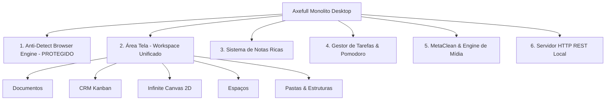

# Mapa de Projetos Internos e Motores Mesclados no Repositório

## Apresentação
Devido ao modelo de desenvolvimento incremental, este único repositório aglutinou **6 domínios de software distintos** que operam como projetos paralelos dentro do mesmo runtime Electron.

---

## Mapeamento de Motores e Projetos Internos

---

## Detalhamento de cada Sub-Projeto Interno

### 1. Motor de Navegação Anti-Detect & Perfis *(CONGELADO / FORA DE ESCOPO)*
- **Responsabilidade**: Gerenciamento de múltiplos perfis de navegadores isolados com spoofing de Canvas, WebGL, AudioContext, User-Agent e proxy SOCKS5/HTTP.
- **Localização Principais**: `src/main/features/fingerprint/`, `src/main/features/browser/`, `src/renderer/features/Profiles/`.
- **Status**: 🛑 Protegido e imutável neste plano de refatoração.

### 2. Ecossistema "Área Tela" *(WORKSPACE MULTI-DOMÍNIO — PRIORIDADE MÁXIMA)*
- **Responsabilidade**: Workspace unificado contendo visualizador e editor de documentos, CRM Kanban completo para gestão de leads, canvas infinito 2D com nós visuais e suporte a espaços e pastas organizacionais.
- **Localização Principais**:
  - Página central: `src/renderer/pages/CanvasPage.tsx` (118KB) e `src/renderer/pages/CRMPage.tsx` (64KB).
  - Componentes centrais: `src/renderer/features/Canvas/InfiniteCanvas.tsx` (346KB!), `src/renderer/features/CRM/CRMList.tsx` (78KB), `src/renderer/features/CRM/LeadDetailModal.tsx` (85KB).
- **Problema de Arquitetura**: Múltiplos domínios de negócio (CRM, Canvas, Documentos) dividem a mesma store, sincronizadores de arquivo em disco (`canvasStorage.ts`, `crmStorage.ts`) e o mesmo ciclo de renderização.

### 3. Sistema de Notas Ricas (`NotesPage`)
- **Responsabilidade**: Editor estilo Notion com blocos TipTap, sincronização de rascunhos, modal de widgets desanexáveis (`NotesWidgetWindow.tsx`) e exportações.
- **Localização Principais**: `src/renderer/pages/NotesPage.tsx` (149KB), `src/renderer/features/Notes/`.
- **Status**: Funcional, porém monolítico (149KB em arquivo único de página).

### 4. Gerenciador de Tarefas & Timer Pomodoro
- **Responsabilidade**: Gestão de backlog de tarefas, visualização em agenda/calendário e widget flutuante de contagem regressiva Pomodoro com áudio e persistência local.
- **Localização Principais**: `src/renderer/features/Tasks/`, `src/renderer/context/PomodoroContext.tsx`.

### 5. MetaClean & Motor de Pós-Processamento de Mídia
- **Responsabilidade**: Limpeza de metadados EXIF/FFmpeg de vídeos em lote, sanitização de arquivos e alteração de hashes de arquivos de mídia.
- **Localização Principais**: `src/renderer/pages/DadosClean.tsx`, `src/main/services/bulkEditEngine.ts`, `src/main/services/metaclean.ts`, `src/main/ipc/bulkVideoIpc.ts`.

### 6. Servidor REST API Local para Automação Externas
- **Responsabilidade**: Servidor Express embutido que escuta requisições na porta HTTP `54345` para comandos remotos de criação de perfis, execução de proxies e consultas de dados.
- **Localização Principais**: `src/main/features/local-api/local-api-server.ts`.

---

## Análise de Projetos Duplicados / Misplaced

1. **Dashboard vs HomeW97**:
   - `Dashboard.tsx` (152KB) atua simultaneamente como gerenciador de perfis, visualizador de dados e container de modais.
   - `HomeW97.tsx` (76KB) re-implementa uma área de trabalho estilo retro com widgets duplicados do Dashboard.
2. **Duplicação de Modais e Contextos**:
   - `CRMContext` e `DashboardContext` expõem estados duplicados para a seleção de perfis e tags, gerando requisições redundantes ao SQLite local e Supabase.
