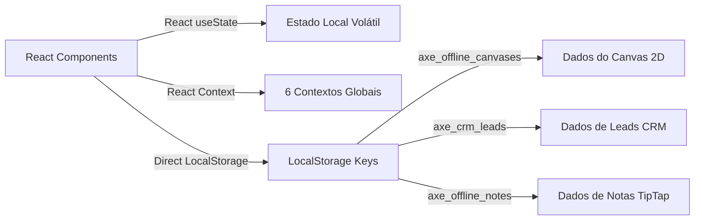

# 01 — Mapa de Estados Globais, Contextos e Stores

## Visão Geral
Mapeamento do gerenciamento de estado no Renderer. A aplicação não utiliza Redux ou Zustand; em seu lugar, utiliza 6 React Contexts globais e múltiplos contextos específicos por feature, além de sincronizadores diretos com `localStorage`.

---

## 1. Contextos Globais de Aplicação (`src/renderer/context/`)

| Nome do Contexto | Arquivo | Estado Armazenado | Consumers Principais | Risco / Avaliação |
|---|---|---|---|---|
| **AuthContext** | `src/renderer/context/AuthContext.tsx` | Estado de autenticação (`loading`, `authenticated`, `unauthenticated`, `offline`), dados do usuário logado e sessão Supabase | `App.tsx`, `ProtectedRoute`, `Sidebar`, `LoginPage`, `SettingsPage` | 🟢 Baixo. Limpo e focado. |
| **WorkspaceContext** | `src/renderer/context/WorkspaceContext.tsx` | Workspace ativo, lista de workspaces, diretório atual, permissões e troca de ambiente | `Sidebar`, `CanvasPage`, `NotesPage`, `CRMPage`, `MembersManager` | 🟡 Médio. Compartilhado por praticamente todos os domínios. |
| **ThemeContext** | `src/renderer/context/ThemeContext.tsx` | Tema visual (dark/light), cores de destaque (accent color) e customizações de interface | `App.tsx`, `Sidebar`, `Topbar`, `SettingsPage` | 🟢 Baixo. |
| **ToastContext** | `src/renderer/context/ToastContext.tsx` | Fila de notificações toast (sucesso, erro, alerta, info) | Praticamente todos os componentes da UI | 🟢 Baixo. |
| **PomodoroContext** | `src/renderer/context/PomodoroContext.tsx` | Cronômetro Pomodoro (tempo restante, estado `running`/`paused`/`break`, sessões concluídas) | `FloatingPomodoro`, `FloatingDock`, `HomeW97` | 🟢 Baixo. |
| **SecurityContext** | `src/renderer/context/SecurityContext.tsx` | Status da licença, nível de segurança, HWID, chave ativada e bloqueios | `App.tsx`, `SettingsPage`, `Sidebar` | 🟢 Baixo. |

---

## 2. Contextos de Funcionalidades Específicas (`src/renderer/features/*`)

| Nome do Contexto | Arquivo Exato | Estado Armazenado | Problema Identificado |
|---|---|---|---|
| **CRMContext** | `src/renderer/features/CRM/CRMContext.tsx` | Estado completo de leads, colunas Kanban, filtros, tags, buscas e estatísticas do CRM | 🔴 Alto acoplamento. O `CRMContext` mantém a lista completa de leads em memória e força re-renders de todo o Kanban a cada digitação de filtro. |
| **DashboardContext** | `src/renderer/features/Dashboard/DashboardContext.tsx` | Estado de seleção de perfis anti-detect, filtros de tags de perfis e ações em massa | 🟡 Risco Médio. Duplica lógica de tags presente na `profiles.db`. |

---

## 3. Estados Locais Críticos e Persistência Paralela

### Problemas de Estado Identificados:
1. **Falta de Store Unificada**: O uso excessivo de `localStorage.getItem()`/`setItem()` diretamente dentro dos renderizadores React (`InfiniteCanvas.tsx`, `CRMList.tsx`) provoca Dessincronização entre abas/janelas.
2. **Re-renderizações em Cadeia**: Alterações no `WorkspaceContext` causam a remontagem de todo o `InfiniteCanvas` (346KB) e de todas as abas do CRM.
