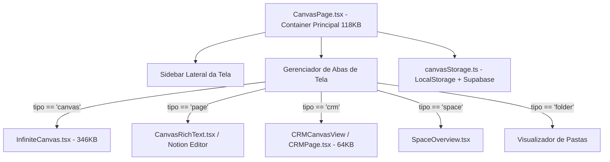

# 02 — Arquitetura Atual da Área Tela

## Visão Geral da Área Tela
A **Área Tela** (localizada em `src/renderer/pages/CanvasPage.tsx` e `src/renderer/features/Canvas/`) atua como o ambiente de trabalho unificado (Workspace) do usuário.

Originalmente concebida como um quadro de notas 2D (Canvas), a Área Tela expandiu-se e passou a abarcar 5 capacidades distintas de negócio:
1. **Documentos**: Visualização e edição linear/rich-text de notas e páginas estendidas.
2. **CRM**: Gestão Kanban e tabela de leads de vendas (`CRMCanvasView` / `CRMPage`).
3. **Canvas**: Editor 2D gráfico de malha infinita (`InfiniteCanvas.tsx` de 346KB).
4. **Espaços**: Agrupadores organizacionais de nível superior no workspace.
5. **Pastas**: Estrutura hierárquica em árvore de itens e sub-pastas.

---

## Estrutura Atual de Composição Visual

---

## Pontos Críticos de Arquitetura Encontrados no Código

1. **Monolito de Roteamento Interno (`CanvasPage.tsx` - 118KB)**:
   - *Confirmado no código*: A `CanvasPage` lê do `localStorage` as abas abertas (`axe_canvas_open_tabs`) e alterna entre renderizar o `InfiniteCanvas`, `CanvasRichText`, `CRMCanvasView` ou `SpaceOverview` dentro de uma mesma `div` reutilizando o mesmo estado de navegação.
2. **Acoplamento de Dados Heterogêneos**:
   - *Confirmado no código*: A função `getCanvasList()` em `canvasStorage.ts` retorna em uma única lista array (`CanvasInfo[]`) objetos do tipo `canvas`, `folder`, `page`, `table` e `space`.
3. **Sobrecarga de Eventos Globais**:
   - *Confirmado no código*: O `InfiniteCanvas.tsx` registra listeners diretos de `window.addEventListener('resize')`, `window.addEventListener('keydown')`, `window.addEventListener('pointermove')` no escopo global do documento, mesmo quando o CRM ou um documento está ativo na aba visível.
