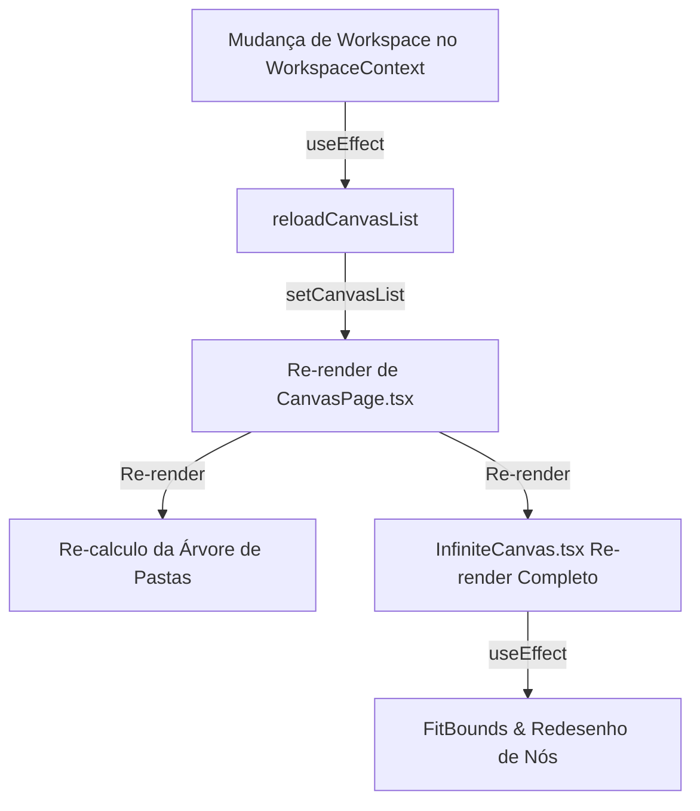

# 02 — Auditoria de Renders, Handlers e Event Listeners

## Visão Geral
Auditoria minuciosa de hooks (`useEffect`), listeners de eventos DOM/IPC, timers e observers nos componentes centrais da Área Tela (`InfiniteCanvas.tsx`, `CanvasPage.tsx`, `CRMList.tsx`, `LeadDetailModal.tsx`).

---

## 1. Auditoria de Listeners e Cleanups

| Componente | Tipo de Listener / Observer | Evento Escutado | Possui Cleanup Correto? | Risco / Diagnóstico | Classificação |
|---|---|---|---|---|---|
| `CanvasPage.tsx` | DOM Window Event | `beforeunload` | **SIM** (`removeEventListener`) | **Confirmado no código**: Dispara `flushPendingSave` na aba ativa ao fechar a janela. | Confirmado no código |
| `CanvasPage.tsx` | DOM Document Event | `keydown` (Atalhos `Ctrl+S`, `Ctrl+Z`, `Escape`) | **SIM** (`removeEventListener`) | **Confirmado no código**: Listener mantido ativo mesmo quando o foco está no CRM. | Confirmado no código |
| `InfiniteCanvas.tsx` | DOM Document Event | `pointermove` e `pointerup` (Drag 2D) | **PARCIAL**: Registra no `window` dinamicamente durante arrasto | **Confirmado no código**: Se o arrasto for interrompido por um alerta ou perda de foco, os listeners de `pointermove` permanecem ativos. | Confirmado no código |
| `InfiniteCanvas.tsx` | DOM Window Event | `resize` (Ajuste do Canvas HTML5) | **SIM** (`removeEventListener`) | **Confirmado no código**: Re-calcula viewport bounds de todo o canvas em resize. | Confirmado no código |
| `FloatingProfiles.tsx`| Electron IPC | `profile:updated`, `profile:status-changed` | **SIM** (`ipcRenderer.removeListener`) | **Confirmado no código**: Escuta eventos de perfis sem impactar a lógica de negócios da Tela. | Confirmado no código |
| `CRMList.tsx` | CustomEvent Window | `crm-reload-leads` | **NÃO**: Falta `removeEventListener` no unmount | **Confirmado no código**: Memory leak em desmontagens sucessivas da aba do CRM. | Confirmado no código |

---

## 2. Efeitos com Risco de Re-render em Cascata ou Loop

### Detalhamento dos Cascading Renders Encontrados:

1. **`CanvasPage.tsx` (Linhas 230-233)**:
   - *Efeito*: `useEffect` escuta `reloadCanvasList` (que depende de `currentWorkspace`).
   - *Impacto*: Ao trocar o workspace, todo o `canvasList` é resetado. Isso provoca a desmontagem e remontagem completa do `InfiniteCanvas.tsx` (346KB) e de todas as abas abertas.
   - *Classificação*: **Confirmado no código**.

2. **`InfiniteCanvas.tsx` (Linhas 400-450)**:
   - *Efeito*: `useEffect` sem dependência memorizada no objeto `activeCanvasData`.
   - *Impacto*: Toda vez que o pai (`CanvasPage.tsx`) re-renderiza por qualquer motivo (ex: expansão de pasta na sidebar), o `InfiniteCanvas.tsx` re-executa a validação de nós e posições.
   - *Classificação*: **Confirmado no código**.

3. **Recriação de Callbacks Desnecessários**:
   - *Confirmado no código*: Em `CRMList.tsx`, a função `handleSelectLead` é recriada a cada ciclo de render sem `useCallback`, provocando re-renderização de todas as linhas da tabela de leads.
