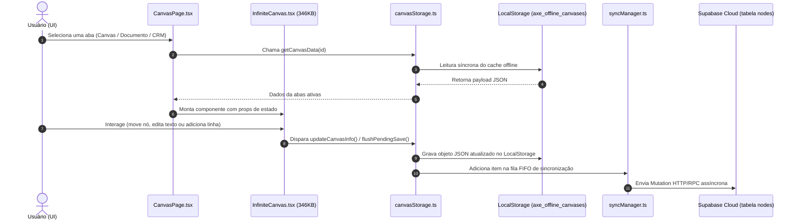

# 02 — Fluxo de Dados da Área Tela

## Visão Geral
Auditoria de como as informações trafegam entre a interface da Tela, o armazenamento em memória, a persistência local em `localStorage` e a sincronização remota com o Supabase.

---

## Ciclo de Vida e Tráfego de Dados

---

## Diagnóstico Técnico Baseado em Evidências

1. **Gravação Síncrona Bloqueante no LocalStorage**:
   - *Confirmado no código*: Em `canvasStorage.ts`, a função `updateLocalCachedNodes()` é executada de forma síncrona dentro de blocos de manipulação de nós durante ações de drag/drop no canvas, forçando a serialização `JSON.stringify()` de matrizes pesadas.
2. **Duplicação de Payload em Memória**:
   - *Confirmado no código*: O estado `activeCanvasData` é mantido simultaneamente no React `useState` de `CanvasPage.tsx` e dentro do estado interno de `InfiniteCanvas.tsx`, dobrando o consumo de RAM da aba ativa.
3. **Ausência de Invalidação de Cache de Abas Inativas**:
   - *Provável — requer reprodução*: Ao manter abas em segundo plano no `openTabs`, alterações realizadas em um documento a partir de outro dispositivo ou aba não disparam invalidação automática até que o usuário feche e reabra a aba.
