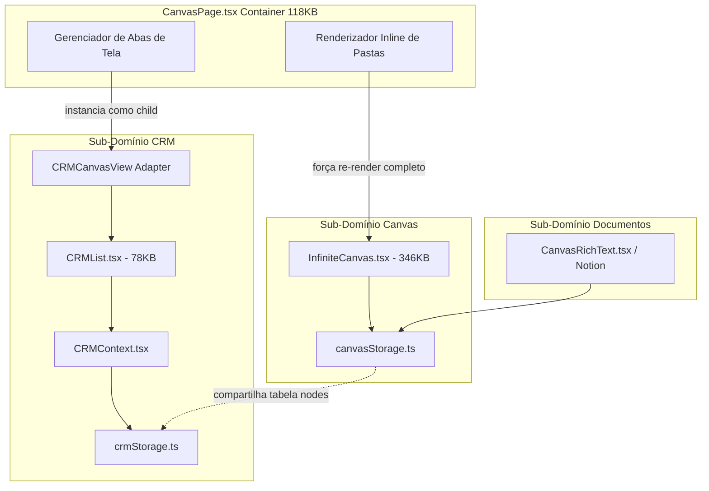

# 02 — Mapa de Dependências da Área Tela

## Visão Geral
Mapeamento das dependências diretas, indiretas, necessárias e indevidas identificadas na Área Tela.

---

## Diagrama de Acoplamento entre Domínios

---

## Tabela de Dependências Por Módulo

| Módulo da Tela | Dependências Necessárias (Legítimas) | Dependências Indevidas / Acidentais | Evidência / Arquivo | Classificação do Problema |
|---|---|---|---|---|
| **Documentos** | `@tiptap/react`, `@tiptap/starter-kit`, `lucide-react` | Dependência direta do `canvasStorage.ts` para persistência em lote com nós de canvas | `CanvasRichText.tsx` chama `updateCanvasInfo()` compartilhando a mesma chave de storage do canvas 2D | *Confirmado no código* |
| **CRM** | `@dnd-kit/core`, `@dnd-kit/sortable`, `date-fns` | Dependência do `CanvasPage.tsx` para exibição de abas e importação do `CRMCanvasView` | `CRMPage.tsx` é renderizado como child em `CanvasPage.tsx` | *Confirmado no código* |
| **Canvas 2D** | `react`, `lucide-react` | Leitura direta do `WorkspaceContext` dentro de loops de renderização de traços de pincel e conexões | `InfiniteCanvas.tsx` (linhas 1-500) escuta alterações de workspace a cada evento de zoom/pan | *Confirmado no código* |
| **Espaços** | `WorkspaceContext`, `lucide-react` | Invocação direta de consultas Supabase misturadas com métodos de remoção de canvas | `SpaceOverview.tsx` invoca `softDeleteCanvas` alterando nós visuais no banco | *Confirmado no código* |
| **Pastas** | `lucide-react` | Manipulação do estado global de abas abertas da Tela (`axe_canvas_open_tabs`) ao renomear uma pasta | `CanvasPage.tsx` (linha 114) atualiza abas visíveis ao alterar o nome de uma pasta | *Confirmado no código* |

---

## Análise de Dependências Externa / Contratos Compartilhados

### 1. Integração com Perfis *(Fingerprint)*
- **Canal IPC / Contrato**: `electron.ipcRenderer.invoke('profile:list')`
- **Risco Registrado**: O componente `FloatingProfiles.tsx` é instanciado no `LayoutManager` sobrepondo a Área Tela. A Tela escuta atualizações de perfis ativas para permitir a vinculação de um nó do canvas a um perfil de navegação.
- **Ação**: O contrato IPC `profile:*` permanece intacto e sem alterações.
