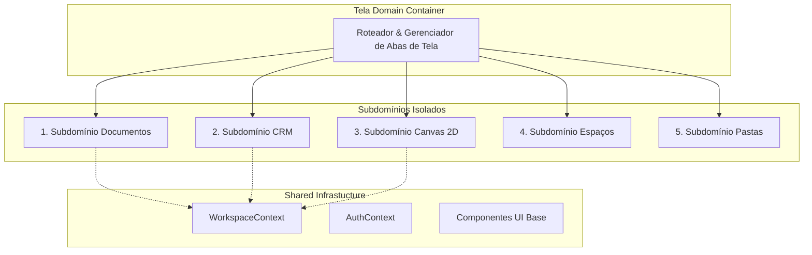

# 02 — Proposta Arquitetural de Isolamento da Área Tela

## Visão Geral
Desenho da proposta de isolamento dos 5 subdomínios da Área Tela, estabelecendo fronteiras claras de responsabilidade, componentes próprios, contratos de serviço e encapsulamento de dados, **sem alterar o comportamento final para o usuário**.

---

## 1. Princípios do Isolamento Arquitetural



---

## 2. Definindo os Limites por Subdomínio

### 1. Subdomínio Documentos (`src/features/tela/documentos/`)
- **Responsabilidade**: Edição e visualização de documentos lineares e notas.
- **Componentes Próprios**: `<DocumentEditor />`, `<DocumentViewer />`, `<DocumentToolbar />`.
- **Serviços Próprios**: `documentService.ts` (API dedicada a documentos).
- **Tipos/Modelos**: `DocumentItem`, `DocumentContent`.
- **Estado**: Estado local do TipTap por documento, sem poluição da árvore do Canvas.

### 2. Subdomínio CRM (`src/features/tela/crm/` ou `src/features/crm/`)
- **Responsabilidade**: Gestão da esteira de vendas, leads e pipelines.
- **Componentes Próprios**: `<KanbanBoard />`, `<KanbanColumn />`, `<KanbanCard />`, `<CRMTable />`, `<LeadModal />`.
- **Serviços Próprios**: `crmService.ts` (API desacoplada do canvasStorage).
- **Tipos/Modelos**: `Lead`, `PipelineStage`, `CRMFilter`.
- **Estado**: Isolated `useCRMStore` ou `CRMProvider` encapsulado.

### 3. Subdomínio Canvas 2D (`src/features/tela/canvas/`)
- **Responsabilidade**: Renderização vetorial e manipulação 2D bidimensional.
- **Componentes Próprios**: `<CanvasViewport />`, `<CanvasGrid />`, `<NodeRenderer />`, `<StrokeRenderer />`, `<CanvasControls />`.
- **Serviços Próprios**: `canvasService.ts` (API focada exclusivamente em malha 2D).
- **Tipos/Modelos**: `CanvasNode`, `Stroke`, `CanvasConnection`, `ViewportState`.
- **Estado**: Estado local isolado por ID de canvas.

### 4. Subdomínio Espaços (`src/features/tela/espacos/`)
- **Responsabilidade**: Gestão de escopo e ambientes.
- **Componentes Próprios**: `<SpaceOverview />`, `<SpaceSelector />`, `<MembersModal />`.
- **Serviços Próprios**: `spaceService.ts`.

### 5. Subdomínio Pastas (`src/features/tela/pastas/`)
- **Responsabilidade**: Organização hierárquica em árvore.
- **Componentes Próprios**: `<FolderTree />`, `<FolderItem />`, `<MoveModal />`.
- **Serviços Próprios**: `folderService.ts`.

---

## 3. Interfaces de Comunicação entre Domínios

1. **Mensageria por Eventos / Props Limpas**:
   Um nó do Canvas pode conter um link para um Lead do CRM. Em vez de o Canvas importar o `CRMContext`, ele recebe uma interface genérica de contrato:
   ```typescript
   interface ExternalLinkContract {
       entityType: 'lead' | 'document' | 'profile';
       entityId: string;
       onOpen: (type: string, id: string) => void;
   }
   ```
2. **Sem Imports Circulares**:
   Regra estrita: O subdomínio `crm` **nunca** importa do subdomínio `canvas`. O container `TelaRouter` faz a composição de abas.
