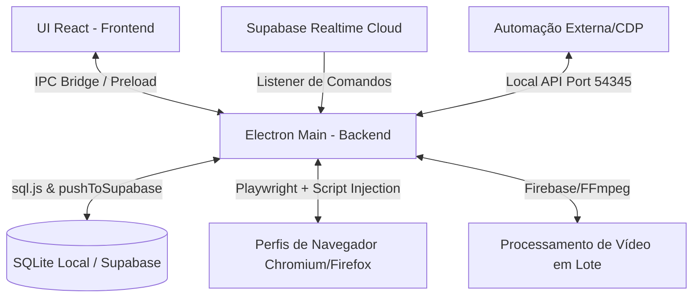

# Guia do Projeto: Axefull - Fingerprint (Axe Agent / W3 MultiLogin)

Este documento funciona como a bússola do nosso projeto. Ele descreve a arquitetura geral do sistema, a organização das pastas, a hierarquia do código, e o funcionamento das camadas de Front-End, Back-End e Banco de Dados (Database).

---

## 1. Visão Geral da Arquitetura

O **Axefull Fingerprint** (também conhecido como **Axe Agent**) é um navegador anti-detect e suite de automação multi-perfil construído sobre o ecossistema **Electron** + **Vite** + **React** + **TypeScript**.

Ele é projetado sob uma arquitetura de processo duplo (característica do Electron):
1. **Main Process (Backend)**: Executa no Node.js. Gerencia o banco de dados local, controla instâncias do navegador (Playwright/Chromium/Firefox), injeta scripts de anti-detecção e expõe uma API local de controle.
2. **Renderer Process (Frontend)**: Executa em um ambiente de página web isolado. Renderiza a interface do usuário em React (Vite) utilizando Tailwind CSS e CSS Modules para um design premium e responsivo.

O diagrama a seguir descreve a comunicação do sistema:



---

## 2. Organização do Código e Hierarquia

O código-fonte está estruturado dentro da pasta `src/`, dividido em responsabilidades claras:

*   **[src/main](file:///c:/Users/FAGNER/Documents/Axefull%20-%20Fingerprint/src/main)**: Código do processo principal (Node.js). Controla o ciclo de vida do app, automação de navegadores, segurança, banco de dados local, criptografia de dados, escuta do Supabase e processamento de mídia.
*   **[src/preload](file:///c:/Users/FAGNER/Documents/Axefull%20-%20Fingerprint/src/preload)**: Scripts de ponte que expõem APIs seguras do Node.js (via `contextBridge`) para o processo do frontend sem comprometer a segurança.
*   **[src/renderer](file:///c:/Users/FAGNER/Documents/Axefull%20-%20Fingerprint/src/renderer)**: Código do frontend (React + Vite). Contém todas as telas, componentes reutilizáveis, contexts de estado global, temas visuais e features específicas do negócio.
*   **[src/types](file:///c:/Users/FAGNER/Documents/Axefull%20-%20Fingerprint/src/types)**: Definições globais de tipos TypeScript usadas por todo o projeto.

---

## 3. Detalhamento do Back-End (Processo Main)

O backend realiza tarefas pesadas do sistema, divididas nos seguintes submódulos principais:

### A. Motor de Anti-Detecção e Perfis de Navegação
*   **[browser-engine.ts](file:///c:/Users/FAGNER/Documents/Axefull%20-%20Fingerprint/src/main/browser/browser-engine.ts)**: Controla a inicialização e encerramento de navegadores Chromium/Firefox através da biblioteca **Playwright**. Ele implementa o isolamento de perfis em pastas locais (`browser_data/<profile_id>`) e constrói cabeçalhos consistentes (User-Agent, Accept-Language, Client Hints).
*   **Spoofing por Injeção de JS ([inject-scripts/](file:///c:/Users/FAGNER/Documents/Axefull%20-%20Fingerprint/src/main/fingerprint/inject-scripts))**: Antes de carregar as páginas web, scripts específicos de mascaramento são injetados no contexto do browser para distorcer assinaturas digitais reais:
    *   `canvas.js`: Adiciona ruídos sutis e únicos em APIs de Canvas 2D para impedir tracking por hash.
    *   `webgl.js`: Altera propriedades de WebGL e insere ruído em renderizações 3D.
    *   `audio.js`: Modifica dinamicamente a resposta de frequência do Web Audio API.
    *   `fonts.js`: Simula e restringe a lista de fontes do sistema disponíveis.
    *   `webrtc.js`: Mascara endereços IP locais e altera o comportamento de conexões WebRTC.
    *   `geolocation.js` / `intl.js` / `sensors.js`: Sobrescrevem dados de GPS, fuso horário, idioma local e sensores de hardware.
    *   `worker-bridge.js`: Garante que as injeções anti-detect se estendam para Service Workers e Web Workers.

### B. Armazenamento e Sincronização Local-Nuvem
*   **[db.ts](file:///c:/Users/FAGNER/Documents/Axefull%20-%20Fingerprint/src/main/database/db.ts)**: Utiliza **sql.js** (SQLite compilado para WebAssembly) para gerenciar dados localmente em memória com persistência atômica em disco (`profiles.db`).
*   **Sincronização com o Supabase**: Sempre que ocorre uma operação de gravação local (Insert/Update/Delete), a função `pushToSupabase` dispara uma atualização assíncrona para sincronizar com as tabelas na nuvem.
*   **[supabase-listener.ts](file:///c:/Users/FAGNER/Documents/Axefull%20-%20Fingerprint/src/main/supabase-listener.ts)**: Escuta em tempo real (via canal WebSockets) novos registros na tabela `launch_commands`. Permite abrir e fechar perfis de forma remota pelo painel web da Axefull.

### C. Automação e Servidor de API Local
*   **[local-api-server.ts](file:///c:/Users/FAGNER/Documents/Axefull%20-%20Fingerprint/src/main/local-api/local-api-server.ts)**: Inicializa um servidor HTTP local na porta `54345`. Ele permite que robôs externos (Puppeteer, Playwright, Selenium) listem, iniciem ou parem perfis locais e acessem o link de depuração do Chrome Developer Protocol (CDP).

### D. Processamento e Edição de Vídeo em Lote
*   **[bulkVideoHandlers.ts](file:///c:/Users/FAGNER/Documents/Axefull%20-%20Fingerprint/src/main/ipc/bulkVideoHandlers.ts)**: Registra canais IPC para automação de mídias.
*   **[renderEngine.ts](file:///c:/Users/FAGNER/Documents/Axefull%20-%20Fingerprint/src/main/renderEngine.ts)** / **[bulkEditEngine.ts](file:///c:/Users/FAGNER/Documents/Axefull%20-%20Fingerprint/src/main/bulkEditEngine.ts)**: Utilizam binários descompactados de **FFmpeg** e **FFprobe** para realizar alterações estruturais em vídeos de forma automática (redimensionamento, alteração de metadados, remoção de faixas de áudio, inclusão de efeitos) e salvam os relatórios no Firebase Firestore.

---

## 4. Detalhamento do Front-End (Processo Renderer)

O frontend foi desenvolvido com foco em performance e estética premium, usando um design escuro moderno, layouts fluídos e micro-animações.

### A. Rotas e Páginas Principais ([src/renderer/pages/](file:///c:/Users/FAGNER/Documents/Axefull%20-%20Fingerprint/src/renderer/pages))
*   **[Dashboard.tsx](file:///c:/Users/FAGNER/Documents/Axefull%20-%20Fingerprint/src/renderer/pages/Dashboard.tsx)**: O hub central do app. Permite listar perfis, pesquisar por tags, ver o status de execução de cada browser, gerenciar proxies, criar pastas e iniciar perfis com um clique.
*   **[CanvasPage.tsx](file:///c:/Users/FAGNER/Documents/Axefull%20-%20Fingerprint/src/renderer/pages/CanvasPage.tsx) / [InfiniteCanvas.tsx](file:///c:/Users/FAGNER/Documents/Axefull%20-%20Fingerprint/src/renderer/features/Canvas/InfiniteCanvas.tsx)**: Um quadro infinito de colaboração avançado que permite criar nós de texto rico (TipTap), notas, cartões integrados do CRM, conexões visuais e setas dinâmicas. Suporta workspaces, proteção de nós por PIN e exportação de dados.
*   **[PipelinePage.tsx](file:///c:/Users/FAGNER/Documents/Axefull%20-%20Fingerprint/src/renderer/pages/PipelinePage.tsx) / [PipelineKanban.tsx](file:///c:/Users/FAGNER/Documents/Axefull%20-%20Fingerprint/src/renderer/features/CRM/components/PipelineKanban.tsx)**: Tela de funil de vendas baseado no Monday.com. Permite criar colunas personalizadas e arrastar cartões de leads (Drag and Drop com `@dnd-kit`), com registro automático de histórico de movimentação.
*   **[DadosClean.tsx](file:///c:/Users/FAGNER/Documents/Axefull%20-%20Fingerprint/src/renderer/pages/DadosClean.tsx)**: Painel para limpeza de metadados de arquivos (imagens, vídeos e PDFs). Lê metadados sensíveis (como coordenadas GPS e modelo de câmera) e remove essas informações antes do upload.
*   **[NotesPage.tsx](file:///c:/Users/FAGNER/Documents/Axefull%20-%20Fingerprint/src/renderer/pages/NotesPage.tsx)**: Aplicativo completo de notas usando TipTap, com formatação avançada, blocos de código e tarefas com checklist.
*   **[LoginPage.tsx](file:///c:/Users/FAGNER/Documents/Axefull%20-%20Fingerprint/src/renderer/pages/LoginPage.tsx)**: Tela de login e autenticação conectada ao Supabase Auth, integrada com proteção por código PIN para desbloqueio local da carteira/perfis.

### B. Provedores de Contexto de Estado Global ([src/renderer/context/](file:///c:/Users/FAGNER/Documents/Axefull%20-%20Fingerprint/src/renderer/context))
*   **[AuthContext.tsx](file:///c:/Users/FAGNER/Documents/Axefull%20-%20Fingerprint/src/renderer/context/AuthContext.tsx)**: Monitora sessões de usuário e tokens de acesso.
*   **[WorkspaceContext.tsx](file:///c:/Users/FAGNER/Documents/Axefull%20-%20Fingerprint/src/renderer/context/WorkspaceContext.tsx)**: Armazena e sincroniza o workspace ativo e seus membros colaboradores.
*   **[SecurityContext.tsx](file:///c:/Users/FAGNER/Documents/Axefull%20-%20Fingerprint/src/renderer/context/SecurityContext.tsx)**: Lida com bloqueio de tela automático, PIN hashes de segurança e criptografia da carteira.
*   **[PomodoroContext.tsx](file:///c:/Users/FAGNER/Documents/Axefull%20-%20Fingerprint/src/renderer/context/PomodoroContext.tsx)**: Oferece um cronômetro de foco (Pomodoro) global integrado diretamente no layout principal para os usuários gerenciarem tempo de trabalho.

---

## 5. Banco de Dados (Database Layer)

O banco de dados é híbrido (local SQLite para alta performance e sincronização instantânea em nuvem no PostgreSQL/Supabase e Firestore/Firebase).

### Esquema do Banco (Supabase/SQLite)

O banco possui as seguintes tabelas estruturais detalhadas em **[supabase_schema.sql](file:///c:/Users/FAGNER/Documents/Axefull%20-%20Fingerprint/supabase_schema.sql)** e **[supabase_crm_schema.sql](file:///c:/Users/FAGNER/Documents/Axefull%20-%20Fingerprint/supabase_crm_schema.sql)**:

1.  **folders**: Agrupamento lógico de perfis de navegação.
2.  **profiles**: Registro principal de perfis anti-detect, guardando estado ativo, notas e tipo de browser.
3.  **fingerprints**: Assinaturas digitais de hardware spoofadas (User Agent, timezone, Canvas Seed, WebGL Seed, etc).
4.  **proxies**: Servidores proxy atrelados a perfis individuais (HTTP, SOCKS5, etc).
5.  **proxy_pool**: Conjunto de proxies compartilhados e testáveis para atribuição dinâmica.
6.  **workspaces & workspace_members**: Suporte a equipes colaborativas e regras de acesso (Viewer, Editor, Owner).
7.  **canvases**: Armazena as notas visuais, conexões, shapes e posições dos nós do Canvas Infinito.
8.  **pipelines & pipeline_stages**: CRM Funnels e seus respectivos estágios de vendas.
9.  **accounts, contacts, deals & activities**: Componentização das tabelas de CRM para controle de contas, contatos, leads e histórico de atividades de vendas.
10. **activity_logs**: Histórico auditável de ações executadas no aplicativo (ex: perfil criado, fingerprint atualizado).

---

## 6. Mapeamento de Arquivos Principais (Bússola de Navegação)

Use a tabela abaixo para localizar rapidamente arquivos essenciais do projeto:

| Componente | Caminho do Arquivo (Clique para abrir) | Descrição |
| :--- | :--- | :--- |
| **Main Process** | [src/main/index.ts](file:///c:/Users/FAGNER/Documents/Axefull%20-%20Fingerprint/src/main/index.ts) | Ponto de entrada, carrega handlers, DB local, API local e listeners. |
| **Handlers IPC** | [src/main/ipc-handlers.ts](file:///c:/Users/FAGNER/Documents/Axefull%20-%20Fingerprint/src/main/ipc-handlers.ts) | Concentra a comunicação entre frontend e backend para perfis e templates. |
| **Navegador** | [src/main/browser/browser-engine.ts](file:///c:/Users/FAGNER/Documents/Axefull%20-%20Fingerprint/src/main/browser/browser-engine.ts) | Lógica de inicialização de navegadores e injeção do sistema anti-detect. |
| **DB Sync** | [src/main/database/db.ts](file:///c:/Users/FAGNER/Documents/Axefull%20-%20Fingerprint/src/main/database/db.ts) | Operações SQL locais em sqlite/sql.js com replicação imediata para o Supabase. |
| **Listener Supabase** | [src/main/supabase-listener.ts](file:///c:/Users/FAGNER/Documents/Axefull%20-%20Fingerprint/src/main/supabase-listener.ts) | Executa comandos remotos (realtime) enviados pelo painel de controle nuvem. |
| **API Local** | [src/main/local-api/local-api-server.ts](file:///c:/Users/FAGNER/Documents/Axefull%20-%20Fingerprint/src/main/local-api/local-api-server.ts) | Expõe endpoints HTTP na porta 54345 para integrações externas e CDP. |
| **Lote Vídeos** | [src/main/ipc/bulkVideoHandlers.ts](file:///c:/Users/FAGNER/Documents/Axefull%20-%20Fingerprint/src/main/ipc/bulkVideoHandlers.ts) | Interface de backend para tarefas do FFmpeg e conexão com Firebase. |
| **MetaClean** | [src/main/metaclean.ts](file:///c:/Users/FAGNER/Documents/Axefull%20-%20Fingerprint/src/main/metaclean.ts) | Lógica de purga de metadados Exif, GPS e software de arquivos JPG/PNG/MP4. |
| **Frontend Central** | [src/renderer/App.tsx](file:///c:/Users/FAGNER/Documents/Axefull%20-%20Fingerprint/src/renderer/App.tsx) | Configuração de rotas de navegação (React Router) e provedores globais. |
| **Página Dashboard** | [src/renderer/pages/Dashboard.tsx](file:///c:/Users/FAGNER/Documents/Axefull%20-%20Fingerprint/src/renderer/pages/Dashboard.tsx) | Gerenciador de perfis principais, busca de proxies e tags na UI. |
| **Quadro Canvas** | [src/renderer/features/Canvas/InfiniteCanvas.tsx](file:///c:/Users/FAGNER/Documents/Axefull%20-%20Fingerprint/src/renderer/features/Canvas/InfiniteCanvas.tsx) | A tela do canvas interativo com suporte a nós e conexões dinâmicas. |
| **CRM Kanban** | [src/renderer/features/CRM/components/PipelineKanban.tsx](file:///c:/Users/FAGNER/Documents/Axefull%20-%20Fingerprint/src/renderer/features/CRM/components/PipelineKanban.tsx) | Visualização Kanban dos cards e movimentação de estágios de vendas. |
| **Editor Perfil** | [src/renderer/features/Profiles/ProfileEditor/CreateProfileModal.tsx](file:///c:/Users/FAGNER/Documents/Axefull%20-%20Fingerprint/src/renderer/features/Profiles/ProfileEditor/CreateProfileModal.tsx) | Interface visual de configuração fina de fingerprints (User Agent, RAM, etc). |

---

## 7. Instruções para Desenvolvimento e Build

Todos os comandos de automação do projeto estão centralizados no **[package.json](file:///c:/Users/FAGNER/Documents/Axefull%20-%20Fingerprint/package.json)**:

### Executando em Desenvolvimento
Para iniciar o servidor de desenvolvimento do frontend (Vite) e o app Electron em tempo real com Hot Reload:
```bash
npm run dev
```

### Build do Projeto
Para compilar o código TypeScript do backend e empacotar o frontend:
```bash
npm run build
```

### Empacotamento Completo (Instalador NSIS)
Para compilar os arquivos e criar o instalador `.exe` da aplicação Axefull Agent para distribuição (gravado na pasta `C:/Users/FAGNER/fingerprint-release`):
```bash
npm run dist
```

---
> [!NOTE]
> Este documento deve ser atualizado sempre que novas tabelas de banco de dados forem inseridas ou novas rotas e injeções anti-detecção forem desenvolvidas para garantir a acurácia como bússola do projeto.
