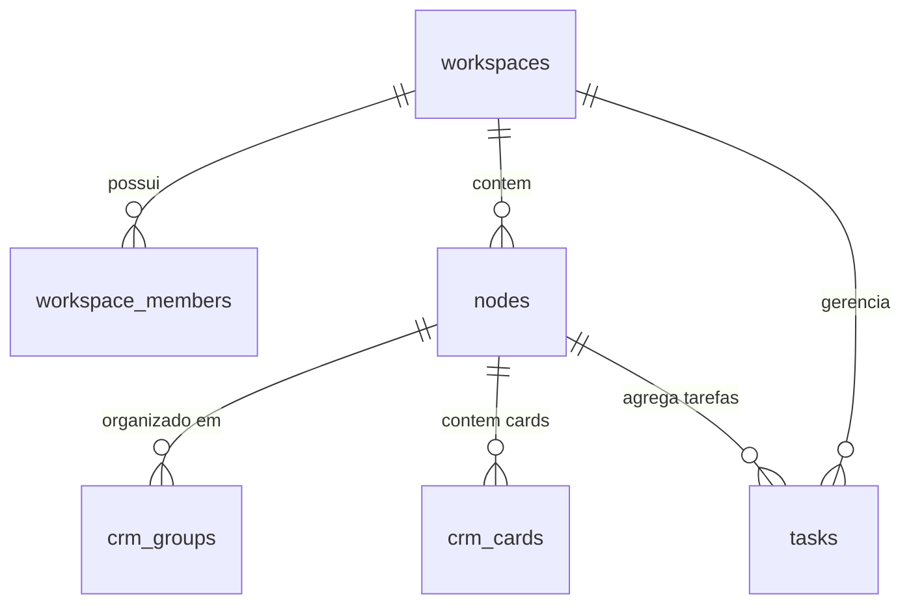
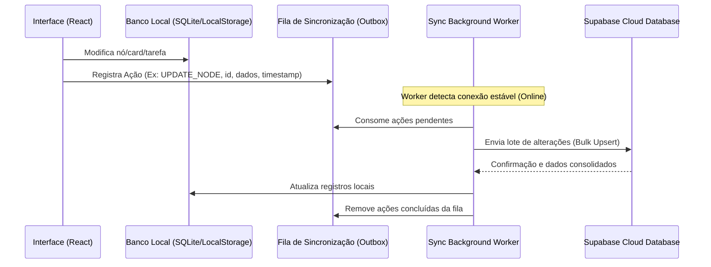

# Armazenamento e Sincronização de Dados (Online & Offline)

Este documento detalha o funcionamento atual do armazenamento de informações no **Axefull Fingerprint** (Espaços, Pastas, Documentos, Canvas, CRM e Tarefas) e propõe uma estratégia técnica para implementação de **sincronização em tempo real de alta performance (Offline-First)**.

---

## 1. Onde as Informações estão Salvas (Mapeamento Atual)

O aplicativo opera sob um estado híbrido definido pela chave `axe_storage_mode` no `localStorage`. Dependendo do modo, os dados são persistidos de duas formas diferentes:

### A. Modo Offline (Armazenamento Local)
Quando `axe_storage_mode` está definido como `offline`, todos os dados são persistidos no navegador/ambiente Renderer usando o **HTML5 LocalStorage**.

| Tipo de Informação | Chave de Armazenamento no LocalStorage | Formato do Conteúdo | Arquivo de Controle |
| :--- | :--- | :--- | :--- |
| **Workspaces** | `axe_offline_workspaces` | Array de objetos Workspace | [WorkspaceContext.tsx](file:///c:/Users/FAGNER/Documents/Axefull%20-%20Fingerprint/src/renderer/context/WorkspaceContext.tsx) |
| **Espaços/Pastas/Documentos** | `axe_offline_canvases` | Lista hierárquica (Tree) de nós (nodos) | [canvasStorage.ts](file:///c:/Users/FAGNER/Documents/Axefull%20-%20Fingerprint/src/renderer/features/Canvas/canvasStorage.ts) |
| **Conteúdo do Canvas** | `axe_offline_canvas_data_${canvasId}` | JSON (Nós do Canvas, viewport e conexões) | [canvasStorage.ts](file:///c:/Users/FAGNER/Documents/Axefull%20-%20Fingerprint/src/renderer/features/Canvas/canvasStorage.ts) |
| **Estágios do CRM (Colunas)** | `axe_offline_crm_groups_${boardId}` | Array de colunas (Título, cor, índice de ordem) | [crmStorage.ts](file:///c:/Users/FAGNER/Documents/Axefull%20-%20Fingerprint/src/renderer/features/CRM/crmStorage.ts) |
| **Cards do CRM (Leads)** | `axe_offline_crm_cards_${boardId}` | Array de leads (valores, contatos, tarefas associadas) | [crmStorage.ts](file:///c:/Users/FAGNER/Documents/Axefull%20-%20Fingerprint/src/renderer/features/CRM/crmStorage.ts) |
| **Painéis de Tarefas** | `axe_offline_tasks_spaces_v1_${workspaceId}` | Array de categorias/pastas de tarefas | [tasksStorage.ts](file:///c:/Users/FAGNER/Documents/Axefull%20-%20Fingerprint/src/renderer/features/Tasks/Tasks/tasksStorage.ts) |
| **Lista de Tarefas** | `axe_offline_tasks_data_v2_${workspaceId}` | Array de tarefas (Status, prioridade, prazos) | [tasksStorage.ts](file:///c:/Users/FAGNER/Documents/Axefull%20-%20Fingerprint/src/renderer/features/Tasks/Tasks/tasksStorage.ts) |

---

### B. Modo Online (Armazenamento em Nuvem)
Quando o modo está definido como `online`, o front-end se comunica diretamente com a nuvem utilizando a API cliente do **Supabase (PostgreSQL)**. 

Os dados do Workspace unificado e das ferramentas de produtividade são mapeados nas seguintes tabelas:



1. **`workspaces`**: Armazena a entidade do Workspace.
2. **`workspace_members`**: Armazena os usuários autorizados a colaborar no workspace e seus papéis (`owner`, `editor`, `viewer`).
3. **`nodes`**: Tabela central do ecossistema. Armazena a árvore hierárquica unificada de itens:
   * **Espaços (`type: 'space'`)**
   * **Pastas (`type: 'folder'`)**
   * **Páginas / Docs (`type: 'page'`)**
   * **Telas de Canvas (`type: 'canvas'`)**: O conteúdo do canvas (elementos desenhados, blocos de notas, posições) é armazenado na coluna JSONB `content_data`.
   * **Quadros Kanban do CRM (`type: 'crm_board'`)**
   * **Quadros de Tarefas (`type: 'task_board'`)**
4. **`crm_groups`**: Colunas/estágios do pipeline do CRM.
5. **`crm_cards`**: Informações dos contatos e leads (valores, dados customizados no campo JSONB `custom_fields`).
6. **`tasks`**: Registra as tarefas vinculadas a um calendário ou quadro de tarefas.

---

## 2. Estratégia para Sincronização em Tempo Real (Online e Offline)

Atualmente, o sistema exige uma mudança manual de chave e não realiza a sincronização automática dos dados locais com a nuvem quando o usuário volta a ficar online. 

Para alcançar uma **sincronização automática, rápida e robusta**, propõe-se a implementação de uma arquitetura **Offline-First baseada em Fila de Ações de Sincronização (Outbox Pattern) com Resolução de Conflitos**.

### Arquitetura de Sincronização Proposta



### Detalhes Técnicos da Implementação

#### 1. Fila de Sincronização (Outbox Pattern)
Criar uma tabela no SQLite local do Electron (gerenciado pelo [db.ts](file:///c:/Users/FAGNER/Documents/Axefull%20-%20Fingerprint/src/main/database/db.ts)) chamada `sync_queue`:

```sql
CREATE TABLE IF NOT EXISTS sync_queue (
    id TEXT PRIMARY KEY,
    table_name TEXT NOT NULL,
    action_type TEXT NOT NULL, -- 'INSERT', 'UPDATE', 'DELETE'
    record_id TEXT NOT NULL,
    payload TEXT NOT NULL,      -- JSON com os dados alterados
    timestamp INTEGER NOT NULL, -- UNIX timestamp da alteração
    attempts INTEGER DEFAULT 0
);
```

#### 2. Escuta de Rede (Network Status Listener)
No frontend React, registrar um listener global de conectividade para alternar o estado do sincronizador:

```typescript
window.addEventListener('online', () => triggerSyncWorker());
window.addEventListener('offline', () => setOfflineModeVisualIndicator());
```

#### 3. Worker de Sincronização
Um serviço em background no processo principal (Main) que:
* Consome a fila `sync_queue` em ordem cronológica quando há internet.
* Realiza operações em lote (`upsert`) no Supabase para reduzir latência e overhead.
* Atualiza a propriedade `updated_at` local com a resposta do Supabase.

#### 4. Resolução de Conflitos (LWW - Last Write Wins)
Para evitar que alterações antigas sobreponham modificações recentes, toda gravação no Supabase e no banco local deve comparar o campo `updated_at`:
* Se o dado que chegou da nuvem possui `updated_at` mais recente do que o local, atualizamos o local.
* Se a alteração local possui `updated_at` mais recente, empurramos para a nuvem.

#### 5. Supabase Realtime Channels (Sincronização entre Dispositivos)
Para que a sincronização ocorra em **tempo real** entre múltiplos usuários online, ativamos o escopo de tempo real do Supabase no frontend React:

```typescript
const channel = supabase
  .channel('table-db-changes')
  .on(
    'postgres_changes',
    { event: '*', schema: 'public', table: 'nodes' },
    (payload) => {
       // Atualiza cache local e avisa a UI React
       handleIncomingCloudChanges(payload);
    }
  )
  .subscribe();
```

---

## 3. Benefícios do Modelo Proposto

> [!TIP]
> **Performance Instantânea**: O usuário interage com dados locais (SQLite / Cache de Memória), fazendo com que a UI responda em < 10ms.
> 
> **Resiliência Total**: O aplicativo funciona normalmente sem internet. Assim que restabelecida, o Sync Worker resolve a fila em segundo plano.
> 
> **Colaboração Viva**: Mudanças feitas por outros usuários no mesmo Workspace aparecem na tela sem necessidade de recarregar a página (Supabase Realtime).

---

## 4. Plano de Ação para Implementação

- [ ] **Fase 1**: Criar a tabela `sync_queue` no banco local [db.ts](file:///c:/Users/FAGNER/Documents/Axefull%20-%20Fingerprint/src/main/database/db.ts) e unificar o gerenciamento local no SQLite em vez de misturar SQLite (main) com LocalStorage (renderer).
- [ ] **Fase 2**: Implementar o wrapper de gravação no frontend (`saveDataAndQueueSync`) que decide se envia direto ou enfileira.
- [ ] **Fase 3**: Desenvolver o `SyncWorker` no processo Main do Electron para enviar os payloads pendentes.
- [ ] **Fase 4**: Habilitar os canais Supabase Realtime no React para receber atualizações instantâneas de outros colaboradores.
